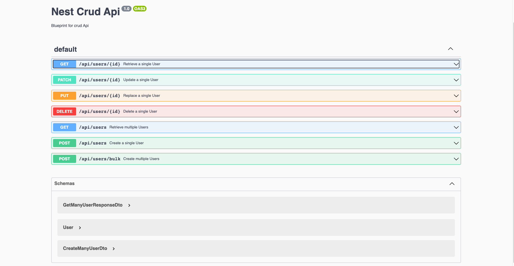

<p align="center">
  <a href="http://nestjs.com/" target="blank"></a>
</p>
  <p align="center">A progressive <a href="http://nodejs.org" target="_blank">Node.js</a> framework for building efficient and scalable server-side applications.</p>


## Project Overview
  <pre>This is a example of a crud api that uses nestjsx/crud dependency to implement crud functionality. 
This project use an relational database sqlite to store data
I also used the swagger ui library to create and interactive ui. See image below.
</pre>

## Running the app
```bash
# development
$ npm run start
# watch mode
$ npm run start:dev
# production mode
$ npm run start:prod
```
## Test
```bash
# unit tests
$ npm run test
# e2e tests
$ npm run test:e2e
# test coverage
$ npm run test:cov